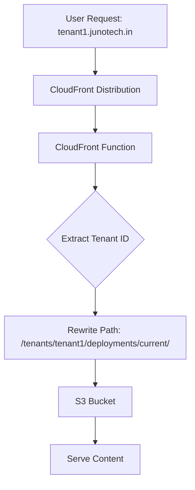

# Shared CloudFront Distribution Architecture

## Overview

This multi-tenant website builder uses a **shared CloudFront distribution** architecture to serve all tenants efficiently while supporting custom domains and SSL certificates.

## Architecture Components

### 1. Shared CloudFront Distribution
- **Single distribution** serves all tenants
- **Wildcard SSL certificate** (*.junotech.in) for all subdomains
- **CloudFront Function** routes requests to correct tenant paths
- **Cost-effective** for handling 100K+ tenants

### 2. URL Structure

#### Tenant Subdomains (Primary)
```
https://tenant1.junotech.in
https://tenant2.junotech.in
https://company.junotech.in
```

#### Direct CloudFront Access (Fallback)
```
https://d1a2b3c4d5e6f7.cloudfront.net/tenant-tenant1/
https://d1a2b3c4d5e6f7.cloudfront.net/tenant-company/
```

#### S3 Path Mapping
```
/tenants/tenant1/deployments/current/index.html
/tenants/tenant2/deployments/current/assets/style.css
/tenants/company/deployments/current/js/app.js
```

### 3. Routing Flow



## Setup Process

### Prerequisites
1. AWS Account with appropriate permissions
2. S3 bucket for static content (`AWS_S3_BUCKET_STATIC`)
3. Domain registered (`CUSTOM_DOMAIN_BASE`)
4. Optional: Wildcard SSL certificate in ACM (`WILDCARD_SSL_CERTIFICATE_ARN`)

### 1. Create Shared Distribution
```bash
# Run the setup script
node scripts/setup-shared-distribution.js
```

This creates:
- CloudFront distribution with wildcard domain support
- CloudFront Function for tenant routing
- Optimized caching and compression settings

### 2. Environment Configuration
Add to your `.env` file:
```env
# Shared CloudFront Distribution
SHARED_CLOUDFRONT_DISTRIBUTION_ID=E1A2B3C4D5E6F7
SHARED_CLOUDFRONT_DOMAIN=d1a2b3c4d5e6f7.cloudfront.net

# Domain Configuration
CUSTOM_DOMAIN_BASE=junotech.in

# SSL Certificate (optional)
WILDCARD_SSL_CERTIFICATE_ARN=arn:aws:acm:us-east-1:123456789012:certificate/12345678-1234-1234-1234-123456789012

# DNS Configuration (optional)
ROUTE53_HOSTED_ZONE_ID=Z1A2B3C4D5E6F7
ROUTE53_ENABLED=true
```

### 3. DNS Configuration
Create CNAME record:
```
*.junotech.in -> d1a2b3c4d5e6f7.cloudfront.net
```

## Deployment Strategy

The system automatically chooses between shared and individual distributions based on tenant requirements:

### Shared Distribution (Default)
- **Standard/Premium tiers**
- **Subdomain-only** (tenant.junotech.in)
- **Wildcard SSL** certificate
- **Cost-effective** for high-volume tenants

### Individual Distribution (Enterprise)
- **Enterprise tier** tenants
- **Custom domains** (company.com)
- **Individual SSL** certificates
- **Performance isolation**
- **Compliance requirements**

## File Structure in S3

```
bucket-name/
├── tenants/
│   ├── tenant1/
│   │   └── deployments/
│   │       ├── build-123/          # Versioned builds
│   │       │   ├── index.html
│   │       │   ├── assets/
│   │       │   └── js/
│   │       └── current/             # Physical current directory
│   │           ├── index.html       # Copied from latest build
│   │           ├── assets/
│   │           └── js/
│   ├── tenant2/
│   │   └── deployments/
│   │       ├── build-456/
│   │       └── current/
│   └── company/
│       └── deployments/
│           ├── build-789/
│           └── current/
└── pointers/                        # Version pointer files
    ├── tenant1/
    │   └── current.json
    ├── tenant2/
    │   └── current.json
    └── company/
        └── current.json
```

## CloudFront Function Logic

The tenant routing function:

1. **Extracts tenant ID** from hostname or path
2. **Validates tenant format** (security)
3. **Rewrites request** to `/tenants/{id}/deployments/current/`
4. **Adds debugging headers** for troubleshooting
5. **Handles fallbacks** for invalid requests

## SSL Certificate Strategy

### Wildcard Certificate (Shared)
- Covers `*.junotech.in`
- Single certificate for all subdomains
- Managed in AWS Certificate Manager (ACM)
- Must be in `us-east-1` region for CloudFront

### Individual Certificates (Custom Domains)
- Required for custom domains (company.com)
- Automatically triggers individual distribution
- Managed per-tenant in ACM

## Performance Characteristics

### Caching Strategy
- **Static assets**: Cached for 1 year
- **HTML files**: Cached for 5 minutes
- **Tenant-specific** cache invalidation
- **Edge locations**: Global distribution

### Scaling Metrics
- **Single distribution**: Supports 100K+ tenants
- **Cold start**: <1ms (CloudFront Function)
- **Global reach**: All AWS edge locations
- **Cost per tenant**: ~$0.01/month at scale

## Monitoring and Debugging

### CloudWatch Logs
- CloudFront Function logs in `us-east-1`
- Tenant routing decisions logged
- Debug headers in responses

### Debugging Headers
```
X-Tenant-Id: tenant1
X-Original-Host: tenant1.junotech.in
X-Original-Uri: /about.html
X-Rewritten-Uri: /tenants/tenant1/deployments/current/about.html
```

### Health Checks
```bash
# Check distribution status
curl -H "Host: tenant1.junotech.in" https://d1a2b3c4d5e6f7.cloudfront.net/

# Check direct access
curl https://d1a2b3c4d5e6f7.cloudfront.net/tenant-tenant1/

# Verify headers
curl -I https://tenant1.junotech.in/
```

## Troubleshooting

### Common Issues

1. **Distribution not found**
   - Run setup script: `node scripts/setup-shared-distribution.js`
   - Verify environment variables

2. **SSL certificate errors**
   - Ensure certificate is in `us-east-1`
   - Verify wildcard domain matches

3. **DNS resolution fails**
   - Check CNAME record configuration
   - Verify hosted zone settings

4. **404 errors for tenant content**
   - Ensure `/current/` directory exists in S3
   - Check tenant ID extraction logic

5. **Function execution errors**
   - Review CloudWatch logs in `us-east-1`
   - Validate function code syntax

### Diagnostic Commands

```bash
# Verify shared distribution exists
node scripts/verify-cloudfront-setup.js

# Test tenant routing
curl -v https://tenant1.junotech.in/

# Check S3 structure
aws s3 ls s3://your-bucket/tenants/tenant1/deployments/

# View CloudFront Function logs
aws logs describe-log-groups --log-group-name-prefix "/aws/cloudfront/function"
```

## Migration Guide

### From Individual to Shared
1. Create shared distribution
2. Update DNS records to point to shared domain
3. Copy tenant content to shared S3 structure
4. Update deployment scripts
5. Gradually migrate tenants

### From Shared to Individual (Enterprise)
1. DeploymentStrategySelector automatically detects requirements
2. Individual distribution created on-demand
3. Custom SSL certificate configured
4. DNS updated to new distribution
5. Content copied to individual S3 structure

## Security Considerations

### Tenant Isolation
- **Path-based isolation** in S3
- **Separate cache keys** per tenant
- **Validated tenant IDs** prevent traversal

### SSL/TLS
- **TLS 1.2 minimum** enforced
- **SNI-only** SSL support (cost-effective)
- **Wildcard certificates** for subdomains

### Access Control
- **CloudFront OAI** restricts S3 access
- **No direct S3 access** for end users
- **Signed URLs** for private content (if needed)

## Cost Analysis

### Shared Distribution Benefits
- **Fixed cost** per distribution (~$0.60/month)
- **Request pricing** scales linearly
- **Data transfer** optimized through edge caching
- **Certificate cost** shared across all tenants

### Example Monthly Costs (100K tenants)
- CloudFront distribution: $0.60
- SSL certificate: $0.75
- Data transfer (1TB): $85
- Requests (10M): $10
- **Total: ~$96/month** for 100K tenants
- **Cost per tenant: ~$0.001**

Compare to individual distributions:
- 100K distributions: $60,000/month
- SSL certificates: $75,000/month
- **Total: $135,000/month**

## Next Steps

1. **Run setup script** to create shared distribution
2. **Configure DNS** with wildcard CNAME
3. **Test tenant routing** with sample content
4. **Monitor performance** and adjust caching
5. **Scale gradually** and monitor costs

For questions or issues, check the troubleshooting guide or review CloudWatch logs.